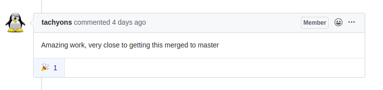

This blog comes as the first of the series that follows, Pretty excited :).

Started with the CV-mobile app and got my first PR merged [#1](https://github.com/CircuitVerse/mobile-app/pull/1). This mostly focussed on the set up of `provider architecture` and `services` along with `get_it` dependency injection. Setup also includes the `github workflow` for better organised and clean code.

Personal Preference Alert : `get_it` keeps life lot easier for `dependency injection`.

```bash
mobile-app/lib/
├── enums/                          # enum files go here
|   └── view_state.dart             # defines view states i.e Idle, Busy, Error
├── managers/                       # managers go here
|   └── dialog_manager.dart         # show dialogs using dialog navigation key
├── models/                         # model classes go here
|   └── dialog_models.dart          # dialog request and response models
├── services/                       # services
|   └── dialog_service.dart         # handles dialog
|   └── local_storage_service.dart  # handles local storage (shared prefs)
|   └── navigation_service.dart     # handles navigation using global navigation key
├── ui/                             # UI layer
|  ├── views/                       # views go here
|  |  └── base_view.dart
|  |  └── home_view.dart
|  |  └── login_view.dart
|  |  └── startup_view.dart
|  └── components/                  # shared components ho here
├── utils/                          # utilities such routes.dart and styles.dart
├── viewmodels/                     # Viewmodels layer
├── constants.dart                  # App constants go here
├── locator.dart                    # dependency injection using get_it
├── main.dart                       # <3 of the app
```

The architecture follows `MVVM` pattern and `views` extends from `base_view` and viewmodels from `base_model`. `Viewmodels` are registered as `factory` and services as `singleton`.

Let's flutter over further.. Fired the next PR [#2](https://github.com/CircuitVerse/mobile-app/pull/2) focussing on all `home_view` and related `tests`.. never thought testing would be so much fun, believe me it's so _relieving_ to see those tests pass.. :) Done with the basic screens too for now, will be shooting up next PR regarding same..

### Lets's Head Over to the APIs now..

Now we are in beast mode.. Haha just kidding :P..Let's get to work.

So, it all started with a lot (and i mean it) of reading through the rails documentation, CV codebase and other stuff. I can bet this helps a lot, got a lot of insigts regarding how the API needs to be structured, modular error handling, pagination and stuff.

This Week of work includes authentication and users API.

### Authentication

For authentication API, the most accepted way of authentication being **Token Authentication** took me to `ruby-jwt` gem. Token auth uses public private key RSASSA algorithm for cryptographic signing.

```bash
~ openssl genrsa -out /circuitverse/config/private.pem 2048
~ openssl rsa -in /circuitverse/config/private.pem -outform PEM -pubout -out /circuitverse/config/public.pem
```

`app/lib/json_web_token.rb` handles the logic for encoding and decoding of the `user_details` and the `token` respectively.

```ruby
class JsonWebToken
  def self.encode(payload)
    payload.reverse_merge!(meta)
    JWT.encode(payload, private_key, "RS256")
  end

  def self.decode(token)
    JWT.decode(token, public_key, true, algorithm: "RS256")
  end

  # Default options to be encoded in the token
  def self.meta
    {
      exp: 30.days.from_now.to_i
    }
  end

  # for encoding
  def self.private_key
    OpenSSL::PKey::RSA.new(File.open(Rails.root.join("config", "private.pem"), "r:UTF-8"))
  end

  # for decoding
  def self.public_key
    OpenSSL::PKey::RSA.new(File.open(Rails.root.join("config", "public.pem"), "r:UTF-8"))
  end
end
```

I love extending `classes` :P. So, we have a `base_controller.rb` that inherits from `ActionController::API`. This mostly handles the `rescue_from` different possible errors, some of them being `Pundit::NotAuthorizedError`, `ActiveRecord::RecordNotFound` etc. Pagination is also well handled using the [`will_paginate`](https://github.com/mislav/will_paginate) gem and follows [`json:api`](https://jsonapi.org/format/) specs.

```ruby
def link_attrs(resource, base_url)
  {
    self: paginated_url(base_url, resource.current_page),
    first: paginated_url(base_url, 1),
    prev: paginated_url(base_url, resource.previous_page),
    next: paginated_url(base_url, resource.next_page),
    last: paginated_url(base_url, resource.total_pages),
  }
end
```

The controller lives in `app/controller/api/v1/authentication_controller.rb`, handles the logic and signup endpoints.

```ruby
# login
@user = User.find_by!(email: params[:email])
if @user&.valid_password?(params[:password])
  token = JsonWebToken.encode(user_params)
  render json: { token: token }, status: :accepted
elsif @user
  api_error(status: 401, errors: "invalid credentials")
end

# signup
if User.exists?(email: params[:email])
  api_error(status: 409, errors: "user already exists")
else
  @user = User.create!(signup_params)
  token = JsonWebToken.encode(user_params)
  render json: { token: token }, status: :created
end
```

### Users

Let's start with serializers, Wikipedia puts it aptly as

> "Serialization is the process of translating data structures or object state into a format (json here) that can be stored or transmitted".

We have a `users_serializer` that selectively serializes different user's attributes so that we don't expose irrelevant data/attributes :) Also, we settled up on using [Netflix's fast_jsonapi](https://github.com/Netflix/fast_jsonapi) for serialization.

```ruby
class Api::V1::UserSerializer
  include FastJsonapi::ObjectSerializer

  # only name is serialized if all users are fetched
  attribute :name

  # only serialized if user fetches own details
  attributes :email, :subscribed, :created_at, :updated_at,
  if: Proc.new { |record, params|
    params[:has_details_access] == true || record.admin
  }

  attributes :admin, :country, :educational_institute,
  if: Proc.new { |record, params|
    params[:are_all_users_fetched] != true || record.admin
  }
end
```

_"So far so good"_

Let's head over to the `users_controller`. This handles various actions including `index`, `show`, `update` etc..

```ruby
def index
  @users = paginate(User.all)
  @options = { params: { are_all_users_fetched: true } }    # serializes only name
  @options[:links] = link_attrs(@users, api_v1_users_url)   # pagination links
end

def show
  @user = User.find(params[:id])                            # find user by id
  @options = { params: {
    has_details_access: @user.eql?(@current_user)           # serializes all details only if fetched self details
  }}
end

def me
  @current_user                                             # logged in user
  @options = { params: { has_details_access: true } }       # serializes all details
end

def update
  @user.update!(user_params)                                # updates user params
end
```

This comment made my day, thanks [@tachyons](https://github.com/tachyons/) :P

<p align="center">
	
</p>

_That's all folks :)_

For the complete documentation of the API, you gotta go to [**docs**](https://nitish145.github.io/slate/) and for the details of this PR head over to [#1431](https://github.com/CircuitVerse/CircuitVerse/pull/1431).

In the upcoming week, I'll be working on Projects and Groups API. Stay tuned for updates!
