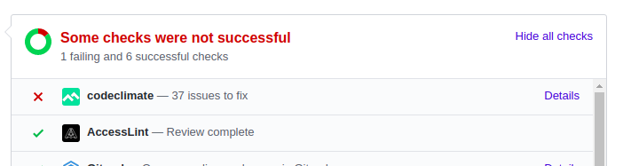

Hey Guys, Welcome back to series, hope you were waiting for me because i was for you.. There is a lot for this week let's dive into the stuff then..

So, i started my week with some tweaks to the already completed `User` and `authentication` API. But hey, wait life isn't so easy because tweaks aren't so easy.. Here comes `codeclimate` to give you some chills. But you know what [@tachyons](https://github.com/tachyons/) told me not to worry about some of those issues and my PR was merged.. What a relief was that :).. but but be with me `codeclimate` is not gonna leave me like this :(

Ok enough talk let's talk some coding..
I had some hands on `projects controller` that would handle all projects related stuff that includes starring, forking, sorting filtering and all.. Wanna see some code.. Here we go :)

```ruby
# GET /api/v1/projects
def index
  @projects = if @current_user.nil?
    Project.public_access
  else
    Project.where("author_id = ? OR  project_access_type = ?", @current_user.id, "Public")
  end
  @options[:links] = link_attrs(paginate(@projects), api_v1_projects_url)
  render json: Api::V1::ProjectSerializer.new(paginate(@projects), @options)
end

# Want some details hit this GET /api/v1/projects/:id
def show
  @project = Project.find(params[:id])
  @author = @project.author
  authorize @project, :check_view_access? # you should have access though :)
  render json: Api::V1::ProjectSerializer.new(@project, @options)
end

# Want to change something, PATCH /api/v1/projects/:id
def update
  authorize @project, :check_edit_access? # do you have edit access.. ??
  @project.update!(project_params)
end

# DELETE /api/v1/projects/:id
def destroy
  authorize @project, :author_access? # no need to mention access everywhere, oh i just did :P
  @project.destroy!
  render json: {}, status: :no_content
end

# Wan't your project featured, have a look at those first
# GET /api/v1/projects/featured
def featured_circuits
  @projects = Project.joins(:featured_circuit).all
  render json: Api::V1::ProjectSerializer.new(paginate(@projects), @options)
end
```

Wan't to filter or sort your projects...

```ruby
def filter
  @projects = @projects.tagged_with(params[:filter][:tag]) if params.key?(:filter)
end

def sort
  return unless params.key?(:sort)

  @projects = @projects.order(SortingHelper.sort_fields(params[:sort], SORTABLE_FIELDS))
end
```

These covers the basics, let's rest others You must have some reasons to go to our [github](https://github.com/CircuitVerse/CircuitVerse) too :)

Just a side note, it feels ecstatic to see `coveralls` coverage go up in your [PR](https://github.com/CircuitVerse/CircuitVerse/pull/1431)..

Let's head over to some other stuff.. Projects is done.. You might wanna form groups, add members, assignments..

_"Stay calm and believe in CircuitVerse"_

As far as groups are concerned we have `groups`, `group_members`, `assignments` controller.
First things first, `groups_controller.rb`. We haven't talked about `selective including` yet but will have a look over that here..

```ruby
# Want to see your groups, GET /api/v1/groups
def index
  @groups = paginate(@current_user.groups)
  # selective including assignments and group_members
  @options[:include] = include_resource if params.key?(:include)
  render json: Api::V1::GroupSerializer.new(@groups, @options)
end

# Mentors and student at same time, not allowed in GSoC but we do at CircuitVerse :P
# GET /api/v1/groups_mentored
def groups_mentored
  @groups = paginate(@current_user.groups_mentored)
  @options[:include] = include_resource if params.key?(:include)
  render json: Api::V1::GroupSerializer.new(@groups, @options)
end

# GET /api/v1/groups/:id
def show
  @group = Group.find(params[:id])
  render json: Api::V1::GroupSerializer.new(@group)
end

# Let's not repeat update and destroy pretty straight forward
# PATCH /api/v1/groups/:id
# DELETE /api/v1/groups/:id

# the promised stuff, include=group_members,assignments
def include_resource
  params[:include].split(",")
                  .map { |resource| resource.strip.to_sym }
                  .select { |resource| ALLOWED_TO_BE_INCLUDED.include?(resource) }
end
```

You might want to add and delete members to your groups.. here comes `group_members_controller.rb`. For routing we use shallow routing here.. More details [here](https://guides.rubyonrails.org/routing.html#nested-resources)

```ruby
# Want to add someone to your group, we've got you covered
# POST /api/v1/groups/:group_id/group_members/
def create
  parse_mails(params[:emails])
  newly_added = @valid_mails - @existing_mails

  newly_added.each do |email|
    user = User.find_by(email: email)
    if user.nil?
      @pending_mails.push(email)
      PendingInvitation.where(group_id: @group.id, email: email).first_or_create
    else
      @added_mails.push(email)
      GroupMember.where(group_id: @group.id, user_id: user.id).first_or_create
    end
  end

  render json: { added: @added_mails, pending: @pending_mails, invalid: @invalid_mails }
end

# Got some reason to delete a student from your group, don't hold back your hands
# DELETE /api/v1/group_members/:id
def destroy
  @group_member = GroupMember.find(params[:id])
  @group_member.destroy!
  render json: {}, status: :no_content
end
```

Evaluations in mind, student's life is gonna be hard but yes that's important (says an undergrad `smirks`). Ok, time for some assignments, let's leave for `assignments_controller.rb`..

```ruby
# GET /api/v1/groups/:group_id/assignments
def index
  @assignments = paginate(@group.assignments)
  render json: Api::V1::AssignmentSerializer.new(@assignments, @options)
end

# Details time :P GET /api/v1/assignments/:id
def show
  authorize @assignment, :show?
  render json: Api::V1::AssignmentSerializer.new(@assignment)
end

# Don't want this to be repetitive so skipping create, update, destroy
# POST /api/v1/groups/:group_id/assignments
# PATCH /api/v1/assignments/:id
# DELETE /api/v1/assignments/:id

# Assignment closed but wan't to reopen it, stay calm and hit
# GET /api/v1/assignments/:id/reopen
def reopen
  if @assignment.status != "open"
    @assignment.status = "open"
    @assignment.deadline = Time.zone.now + 1.day
    @assignment.save!
    render json: { "message": "Assignment has been reopened!" }
  else
    api_error(status: 409, errors: "Project is already opened!")
  end
end

# Wanna score better than your peers, start early is the key but how do we start
# GET /api/v1/assignments/:id/start
def start
  authorize @assignment   # can't ley you in if you are not for this, don't take it otherwise :P
  @project = @current_user.projects.new
  @project.name = @current_user.name + "/" + @assignment.name
  @project.assignment_id = @assignment.id
  @project.project_access_type = "Private"
  @project.save!
  render json: {
    "message": "Voila! Project set up under name #{@project.name}"
  }
end
```

We are here for for some interesting stuff only aren't we.. So, i am not gonna metion too mainstream stuff over here.. We need to have the `name` and `email` for the `group_members` but we don't have them directly plugged into our `group_member_model` So, how do we serialize, we've, technically [Netflix's fast jsonapi](https://github.com/Netflix/fast_jsonapi) got you covered :)

```ruby
class Api::V1::GroupMemberSerializer
  include FastJsonapi::ObjectSerializer

  attributes :group_id, :user_id, :created_at, :updated_at

  # here's how we do it, group_member model has_many :users
  attribute :name do |object|
    object.user.name
  end

  attribute :email do |object|
    object.user.email
  end
end
```

_"So far so good"_

> _"Enter Codeclimate and your life will never be same"_

Hey Hey you said `codeclimate` gives you chills, Yes, i did Let's go over that. `Codeclimate` "reviewed" my PR and loved it so much that it threw "only" (sarcasm intended :P) 243 issues for me to resolve and i was flabbergasted :P

Well with some refactoring and a lot of head scratching :P, i was able to boil down the issues to 37. Also, this magical command has earned a special respect in my <3 `rubocop -a /path/to/file/that/haunts/you`

<p align="center">
	
</p>

It's sort of becoming sad, i don't want to end my blog like this. Cheer up guys, The same PR [#1441](https://github.com/CircuitVerse/CircuitVerse/pull/1431) has got `coveralls coverage` increased by 1.07% ,Not bad huh... Devs might connect :)

<p align="center">
	
</p>

_Now that's all folks :)_

For the complete documentation of the API, you gotta go to [**docs**](https://nitish145.github.io/slate/) and for the details of this PR head over to [#1441](https://github.com/CircuitVerse/CircuitVerse/pull/1431).

Next up imma shoot another PR for the groups, assignments and stuff's API.
We will also talk about project collaborations and some rspecs too but that's a story for next Week.

> Till then Sayonara!
