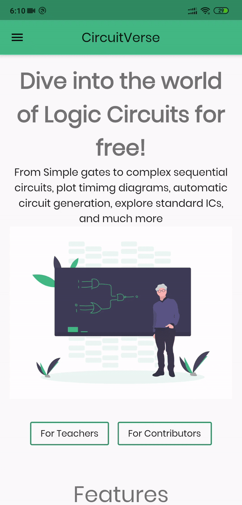
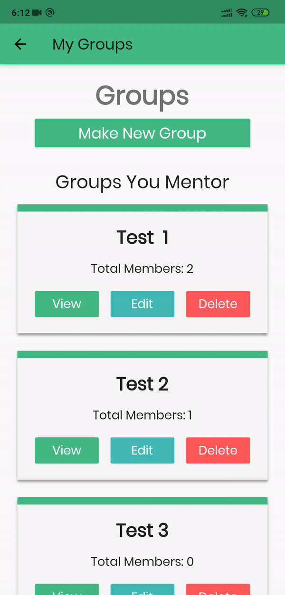
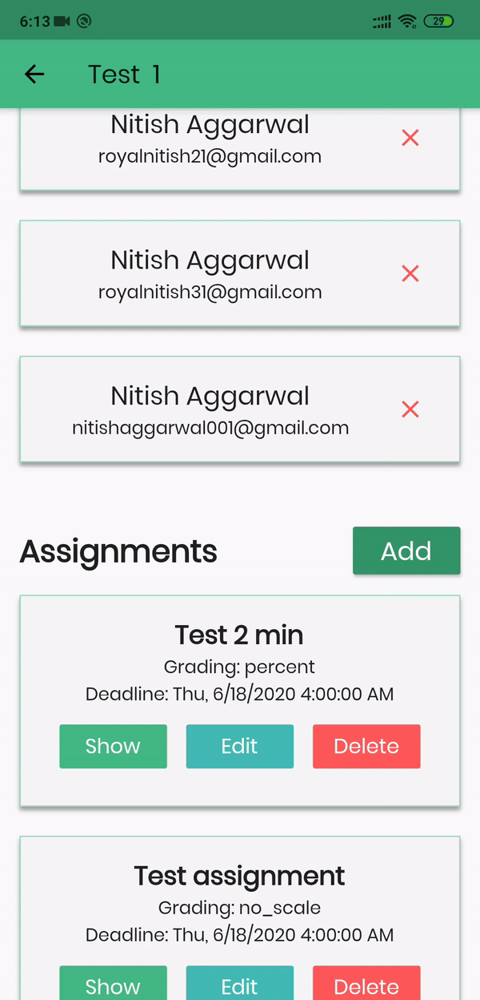
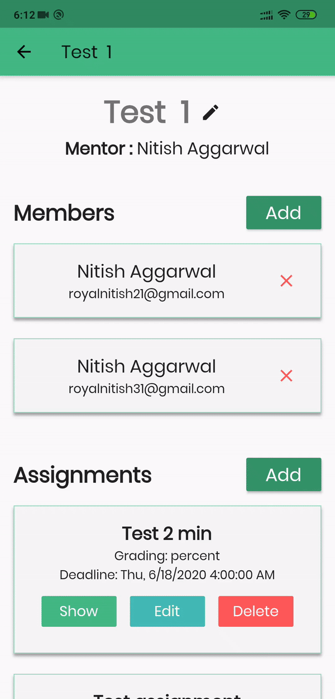
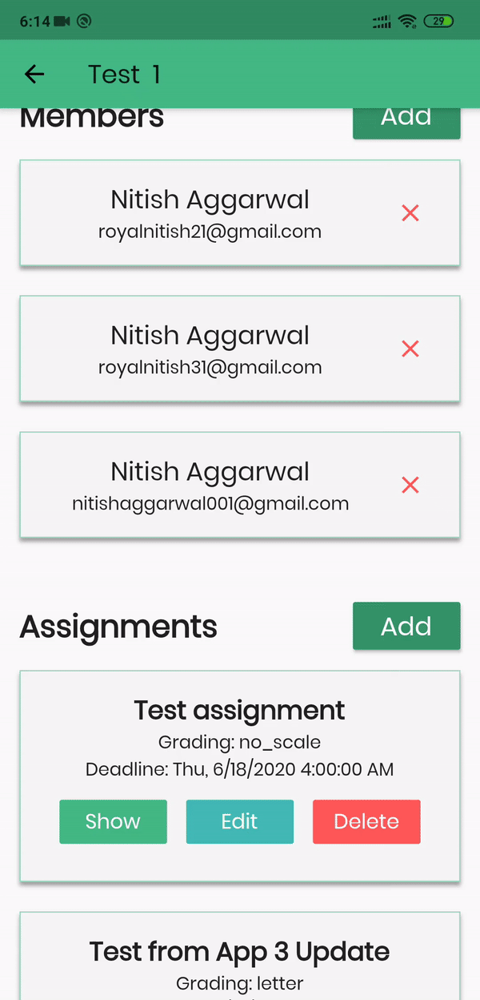

This Week marked the `shubh-aarambh` of CircuitVerse mobile app. This Week was primarily focussed on completing the group's section of the app including contributors, teachers and about views.. The aim was to set up a complete structure for the app..

The basic folder structure and the architecture was discussed in the very first [blog](https://nitish145.github.io/blog/journal/week-1-report.html) of the series. Just a refresher, i plan to use `MVVM` architecture wherein we have the bussiness logic in `viewmodels`, `services` as in just a class created to perform a service for your user, `utils` to handle some computational or logic stuff & `views` for rendering UI..

Let's go over the APIs implementation in the app, APIs logic is handled in services which are just plain classes to handle some logic.. also kimmed through a lot of good articles regarding error handling and try catch block error handling is what caught my attention..

```dart
// lib/services/API/users_api.dart

abstract class UsersApi {
  Future<String> login(String email, String password);
}

class HttpUsersApi implements UsersApi {
  var headers = {"Content-Type": "application/json"};
  http.Client client = new http.Client();

  LocalStorageService _storage = locator<LocalStorageService>();

  @override
  Future<String> login(String email, String password) async {
    String endpoint = "/auth/login";
    String uri = url + endpoint;
    var json = {
      "email": email,
      "password": password,
    };
    // Utils showing their utility :P
    try {
      var jsonResponse = await ApiUtils.post(
        uri,
        headers: headers,
        body: json,
      );
      String token = jsonResponse["token"];
      return token;
    } on UnauthorizedException catch (e) {
      throw Failure(Constants.USER_AUTH_WRONG_CREDENTIALS);
    } on NotFoundException catch (e) {
      throw Failure(Constants.USER_AUTH_USER_NOT_FOUND);
    } on FormatException catch (e) {
      throw Failure(Constants.BAD_RESPONSE_FORMAT);
    } on Exception catch (e) {
      throw Failure(Constants.GENERIC_FAILURE);
    }
  }
}
```

> With abstraction in place testing APIs logic and mocking responses has become so easy..

One layer down, let's go over the viewmodels, `login_viewmodel.dart` handles the bussiness logic for login functionality, bussiness logic as in instantiating `services`, asking services to the needful, notify `views` i.e handling state.

```dart
// lib/viewmodels/authentication/login_viewmodel.dart

class LoginViewModel extends BaseModel {
  final UsersApi _userApi = locator<UsersApi>();

  bool _isLoginSuccessful = false;

  bool get isLoginSuccessful => _isLoginSuccessful;

  set isLoginSuccessful(bool isLoginSuccessful) {
    _isLoginSuccessful = isLoginSuccessful;
    // notifes views about the login success..
    notifyListeners();
  }

  Future<void> login(String email, String password) async {
    setState(ViewState.Busy);
    try {
      String token = await _userApi.login(email, password);
      // saving current user to the local storage..
      _storage.currentUser = await _userApi.fetchProfile();
      //update login status
      isLoginSuccessful = true;
      setState(ViewState.Idle);
      SnackBarUtils.showDark("Login Successful");
      // Get for navigation to HomeView if login is successful
      Get.offAllNamed(HomeView.id);
    } on Failure catch (f) {
      // handle failure, show snackbars/toast, log error..
    }
  }
}
```

Other minor things I checked off the list were -

- Add Favourite Projects API [#1499](https://github.com/CircuitVerse/CircuitVerse/pull/1499) - reviewed & merged..
- Adding access attributes in Groups API [#1462](https://github.com/CircuitVerse/CircuitVerse/pull/1462/commits/7f65ed93f699950f298209e8f99094584491e9c0) - in review

For the mobile_app, i am done with `authentication`, `groups`, `group_members` and `assignment's` views, viewmodel & service linkages.. will shoot a PR for the same..

<p align="center" >
    
	
    
    
    
    
</p>

_That's all folks :)_

In the upcoming week i would be focussing over adding tests for the above mentioned `viewmodels` and `services`.. I also plan to `init OAuth` sections i.e github, facebook & google authentication for the app. Stay healthy..

> See Ya Later
