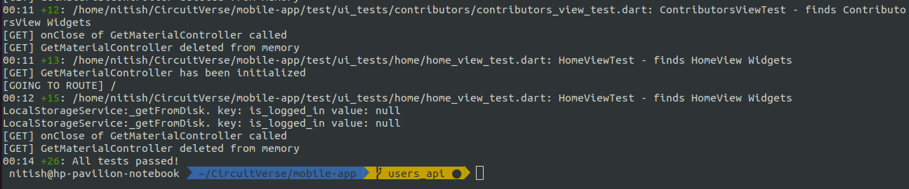

One of most important thing in software development, **testing** that's what this week was focussed onto. As we are coming close to the end of final phase of GSoC, testing & documentation is what is called for. Those green checks and increased coverage is bound to give you chills xD.

<p align="center">
	
</p>

## API Testing (Specs)

This Week i spent time adding specs for Project Comments (PR [#1590](https://github.com/CircuitVerse/CircuitVerse/pull/1590)) & FCM Notifications (PR [#1598](https://github.com/CircuitVerse/CircuitVerse/pull/1598)). Also worked on adding some notifications use cases and ended up with the following :

- Add / Update Assignment.
- New Collaboration.
- Featured Circuit.
- Add / Update Grade.
- Add / Remove GroupMember.

I also worked on a vulnerability in Project comments regarding private projects pointed out by my mentor [@tachyons](https://github.com/tachyons). Now, the private project comments are only accesible to the project's author. Public Projects shall behave the same way though, no need to authenticate to fetch comments and stuff.

> Testing Software may take some time but is very very important Period.

## Mobile App Testing

Started adding tests to `mobile_app` too this week. A bit about `test/` structure is given below.

```bash
mobile-app/test
├── setup/                          # common code for tests go here
|   └── test_data/                  # test_data such as fake contributors and stuff goes here
|   └── test_helpers.dart           # getAndRegisterMockServices to register and return mock service
├── service_tests/                  # services tests
├── viewmodel_tests/                # tests viewmodel behaviour with mocked services
├── ui_tests/                       # UI/widget tests to check proper widgets being rendered for proper use cases
```

I spent time adding tests for authentication `viewmodels` & `views`. While testing viewmodels i realised i had some UI code laying around in viewmodels which cannot be tested and doesn't go with the architecture well. The UI code here being snackbars, dialogs but those too can't be tested in the viemodels without the `WidgetTester` but WidgetTester in viewmodels testing, weird right.. Moved the UI code from `viewmodels` to the `views` and seeing `viewmodels` containing pure business logic holds the architecture's spirits high :)

<p align="center">
	
</p>

In all i added about 25 tests covering most of the use cases for the auth views as well as viewmodels. On a lighter note, `Mocking` is fun but use it cautiously because u may not have any logic at all but the tests would pass xD..

## Next Steps

Where do i go from here? Well onto adding remaining tests..

> See Ya Next Week
